# JavaScript exercises, Part II. (events, DOM)

## Exercise #1 (1): Changing text

- Extend [this HTML page](exercise1.html) such that on moving the mouse over the yellow box the text changes to "Can I help you?". Then, when the mouse is moved outside the box the text changes back to "Hello world!".

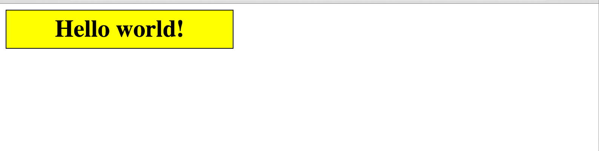

## Exercise #2 (2): Changing colors

- [This page](exercise2.html) contains a 200x200px div. Write JS code that sets the initial color of the div to blue, then changes the color when the div is clicked. On the first click, it changes from blue to red, on the next click from red to green, then from green to blue (and once it's blue, it starts all over again).
- In this exercise, you are only allowed to make changes inside `` and cannot change other parts of the HTML code.

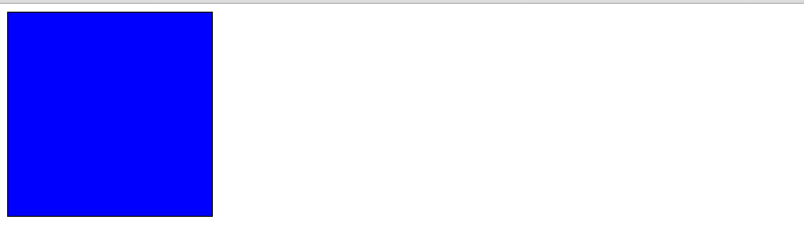

## Exercise #2b (3): Randomizing initial color

- Extend the previous exercise such that the div's initial color is chosen randomly.
- Can you extend the code to work with an array of arbitrary colors? Whenever the div is clicked, change the color to the next on in the array (and start over after the last color).

## Exercise #3 (4): Changing images

- The page shows a select list and a "no image" picture by default.
- Once the user changes the selection in the list, display the selected image.
  - Set the src of the image to the option value and the alt of the image to the name of the option.

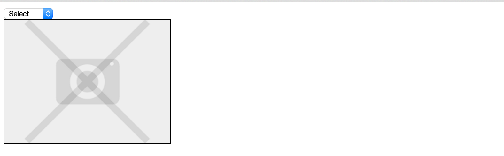
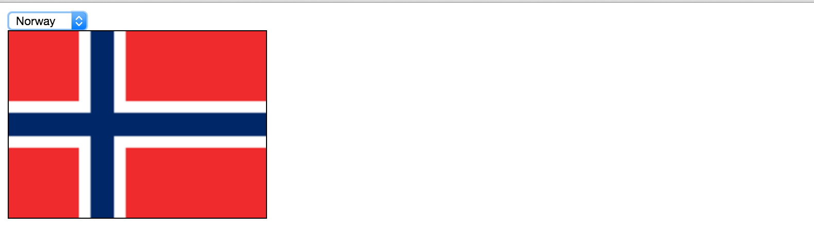

## Exercise #4 (5): Formatting text

- Create a simple what-you-see-what-you-get text editor.
- Change the text inside the "text" div according to the form selections.
- You can find the [starter HTML file with the form controls here](exercise4.html).

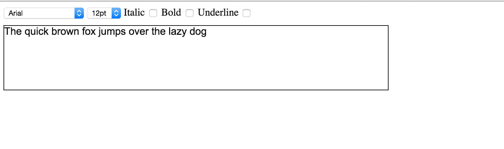

## Exercise #5 (6): Input check

- You are [given a form](exercise5.html) with two password fields and a submit button.
- Perform input check and display an error message next the the corresponding field if there is an error.
  - Passwords must be at least 6 characters long.
  - The two passwords must match.
- The placeholders for the error messages have already been prepared (div-s with class "err").
- By default the submit button should be hidden. Display the button only when there are no errors.

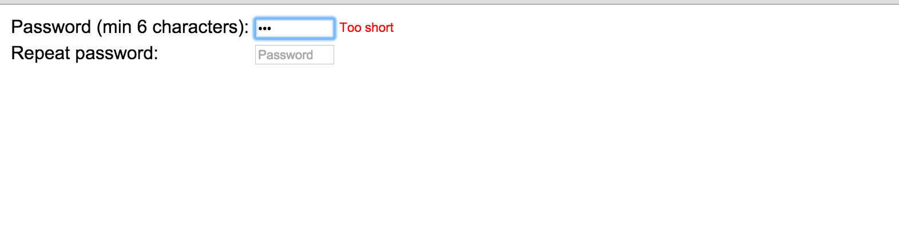
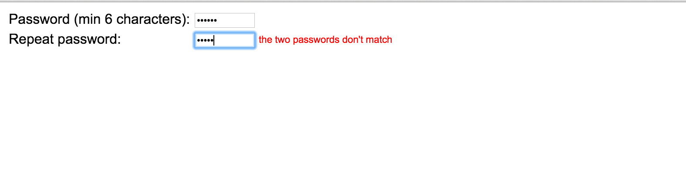
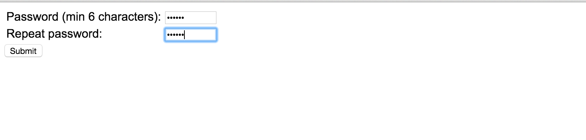

## Exercise #6 (7): Content show/hide

- You are given the [starter HTML file](exercise6.html).
- By default, show only the article headings (this can be achieved by setting the display property of the div with the text to "none" using inline CSS).
- Clicking the "show" link should make the article body appear and the "show" link to disappear.
- Clicking the "hide" link should make the article body disappear and the "show" link appear.

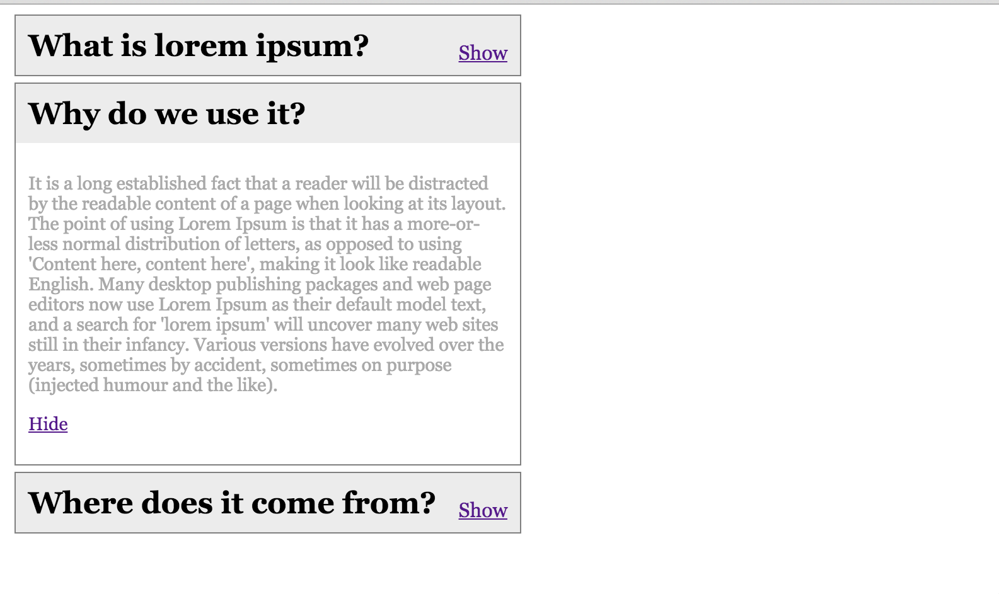

## Exercise #7 (8): Simple playlist

- Create a simple playlist application where users can add songs to a list. The song here is just a non-empty string.
- The [starter HTML file](exercise7.html) contains the form and an empty playlist. There is an [external CSS file](exercise7.css) with the style declarations.

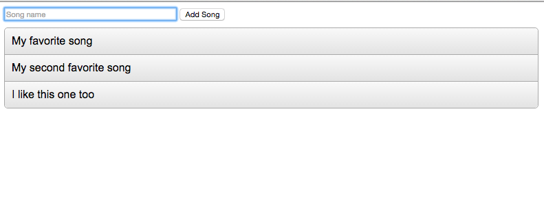

## Exercise #7b (9): Advanced playlist

- Extend the previous exercise such that songs can be removed too. Add a delete link or icon to each song; clicking the link/icon should remove the song from the list.

## Exercise #8 (10): Color picker

- Make a color picker that displays a color palette; display colored tiles (rectangles) in the "colors" div.
- When a colored tile is clicked:
  - write the code of that color inside the "selected" div;
  - set the background of the "selected" div to that color.
- You are given the [HTML file](exercise8.html) and [part of the JS code](exercise8.js) that collects the different colors in an array. (Only the JS file needs to be edited.)

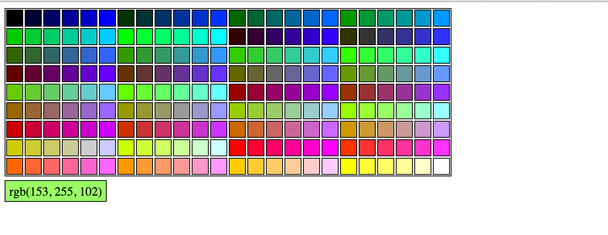

## Advanced Part (No help and for your benifit)

## Exercise #9 (11): Labyrinth game

Make a game where the user (player) needs to find her way out from a labyrinth. The user controls a character (your choosing of hero) with the keyboard arrows. Follow the steps below. Use the starter files [exercise9.html](exercise9.html), [labyrinth.class.js](labyrinth.class.js), and [game.js](game.js).

### Step 1

- The map of the labyrinth is given as a 2-dimensional array (1 represent walls 0 represent empty space). Implement a printConsole() method inside the [Labyrinth class](labyrinth.class.js) that prints the map on the browser console. Use `*` for walls and spaces for empty space.
- Add the printConsole() method to the Labyrinth class.
- Write JS code in [game.js](game.js) that creates a Labyrinth object and call the printConsole() when the page loads.

### Step 2(12)

- Implement a printDisplay(id) method that draws the labyrinth on the screen, inside the element with the provided id.
- Call this method from `game.js` on the `map` div (instead of calling printConsole()).
- Set the size of the parent (`map`) div according to the size of the labyrinth and apply a solid border around it.
- Represent cells as rectangles (divs) with grey background for walls and white background for spaces. The `CELL_SIZE` global variable specifies the size (width and height) of rectangles.
- You can use absolute positioning within the parent (`map`) div (but don't forget to set the positioning of the parent to non-static).

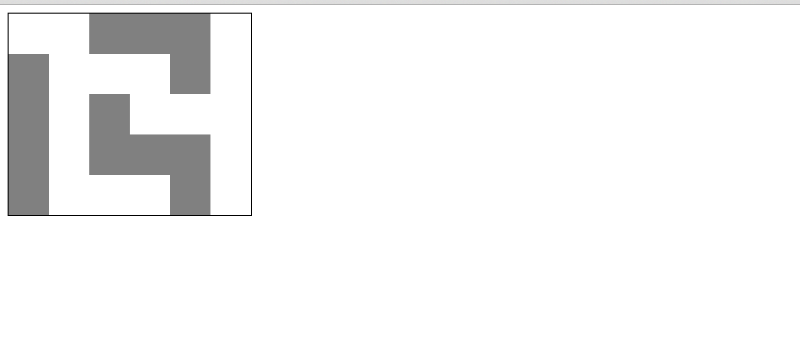

### Step 3(13)

- Extend the class with constants that specify the start and end (destination) coordinates of the character. Initially, the character stands at the start position.
- Display the character on the map. You can use a div with a different background color or an image. Also, indicate the destination cell with a different background color or image.
- Allow the user to move the character up, down, left, and right using the respective keys. For each move, check if the character would (i) move out of the map or (ii) move on a wall, and perform the actual move if there is an empty space to move to.
- Display an alert window with "Congratulations!" if the character reaches the end (destination) cell.

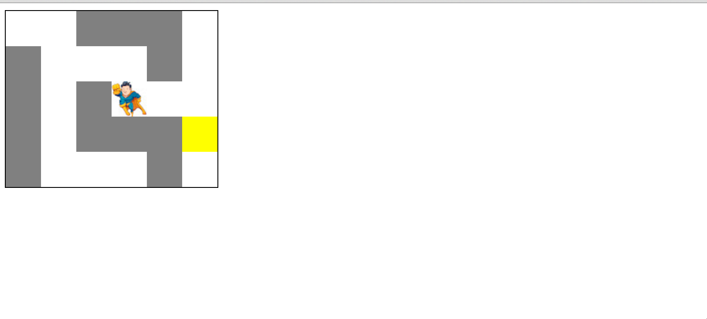

## Exercise #10: Internet Security Breach
Browsers provide a rich set of features that enable interactive, compelling web applications. Unfortunately, these features are also open to abuse. This project demonstrates how web sites can spy on the user, steal sensitive information, and render the browser inoperable.
- Use the Firefox browser for this project, and for all projects in this class.
- you're pretending to be an attacker for this project, so your HTML files do not have to pass validation.
- Unless noted otherwise, avoid the use of external scripts and stylesheets. Everything should be included in the HTML file.

### Part 1. Denial of service
#### a. Endless alert
Create a HTML document that, when opened, displays a JavaScript alert dialog box. Each time the user dismisses the dialog box, a new, identical dialog box should appear. As a result, the user will be unable to interact with the browser window.
- You can put whatever text you want in the alert. (Be creative!)
- To recover from this attack, it may be necessary to terminate your browser process. On Windows, you can use Task Manager (Ctrl+Alt+Del). On Mac OS, you can use Force Quit (Option-⌘-Esc)
- Note that some browsers, such as Opera and Google Chrome, provide mitigations for this attack. Firefox does not.
#### b. Whack-a-mole
Create an HTML page that contains a single button, which has the text "Click here" on it. When the button is clicked, the browser should open an infinite number of popup windows.
- You can put whatever content you want in the popup windows.
- Use a data: URL to give the popup window some content without making a network request.
- Do not wait for the first window to be closed before opening the next one.
- Your solution will be graded with the popup blocker on (the default setting).
- The windows need to actually open visually; it doesn't count if the browser simply hangs.
- You need to open windows, not tabs.
#### c. Sticky page
Create a HTML document that the user cannot navigate away from. If the user tries to enter a URL into the address bar, click a bookmark, or use the search box, the browser should remain at the same location. The browser should stay at this location no matter how many times the user tries to navigate away.
- You can put whatever content you want in the page.
- The attack should work regardless of the URL where the page is located.
- Hint #1: Try navigating the page in an on-unload or on-before-unload handler. Be sure to remove your handler to avoid creating an infinite loop.
- Hint #2: Try using setTimeout to delay your navigation by a few milliseconds.
- It is acceptable (but not required) if the browser's "throbber" (progress indicator) spins for a brief moment before stopping. It should not keep spinning forever, however.
